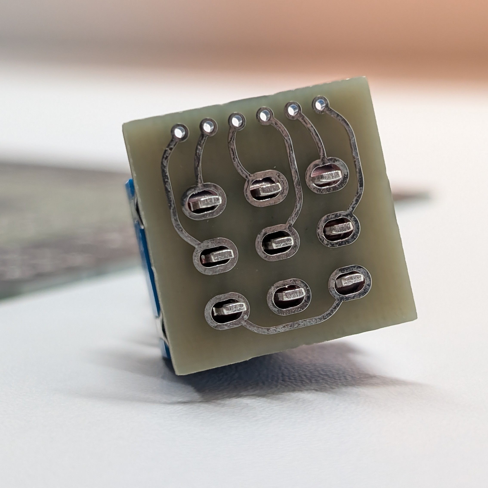
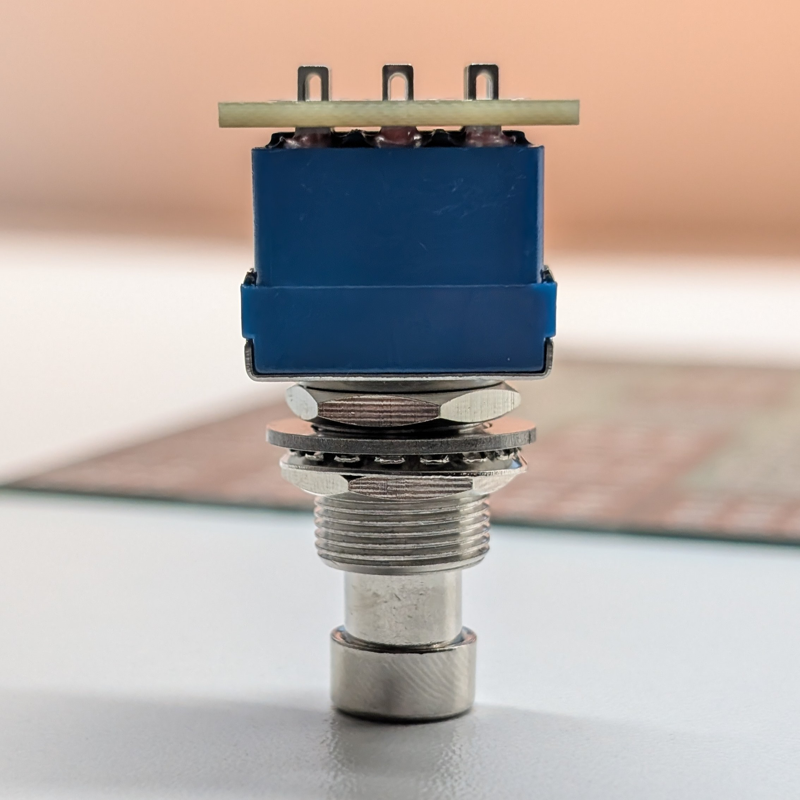
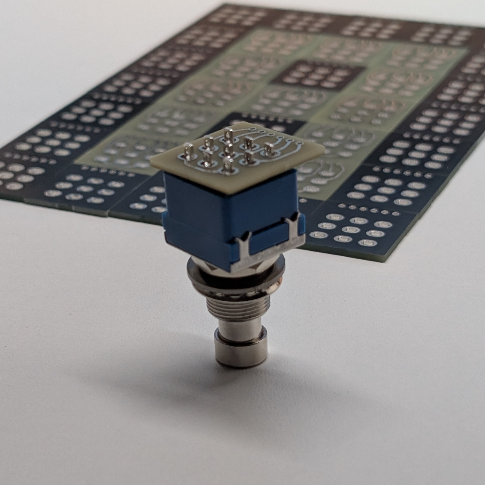
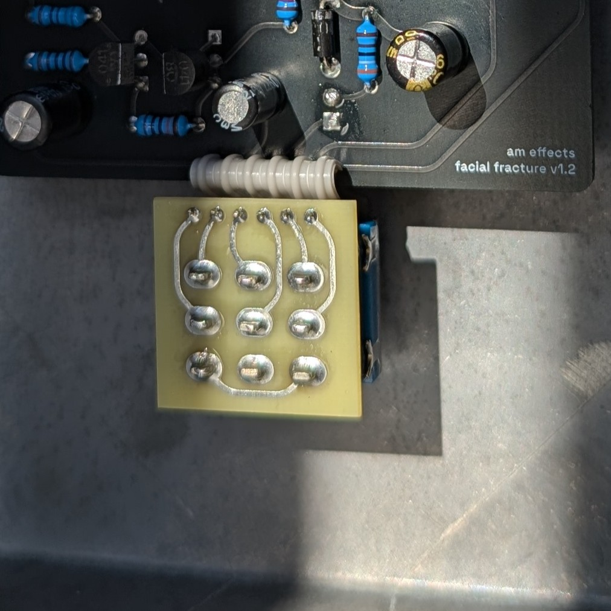
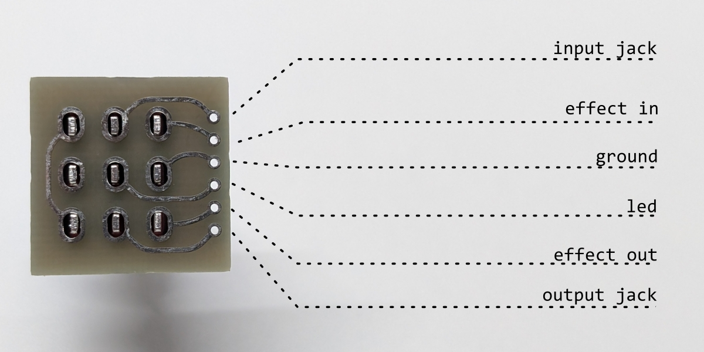

# 3PDT Wiring Board

## What it is?
 
A minimalist daughterboard to keep the wiring of your true bypass 3PDT footswitches tidy.

### Footprint details
In case you want to recreate this design outside of KiCad, here are the key footprint characteristics:

* Pad shape: oval (slotted)
* Pad dimensions: 4 × 3 mm
* Hole: oval, 2.5 × 1.5 mm
* Pad-to-pad spacing: 5.6 mm (horizontal), 4.8 mm (vertical)
* Annular ring: 0.75 mm
* Board outline: 22 × 22 mm
* Board thickness: 1.6 mm

### Recommended wiring

I've intentionally left the silkscreen blank, as I like the clean look. Here's how to wire the board without any markings to guide you. 

 

The middle pins have some flexibility. I prefer wiring one to ground and the other to the LED ground (the LED's other leg is normally wired to +9V via a resistor), as shown in the picture. You may choose to do it the other way round.

## What's included?
 
- KiCad project files (schematic + PCB)
- KiCad custom footprint
- Fabrication files (Gerbers + drill files)

## How can I use this?
 
If you want to go straight to JLC-you-know-who, just download the archive from the `production` folder and upload it to their website. 

> [!TIP]
> If you want the vintage look like in my photos, specify in the PCB remarks that you want the top soldermask removed.

If you want to mess around with this particular board in KiCad, download the `.kicad_pro`, `.kicad_pcb` and `.kicad_sch` files.
 
Alternatively, if you just want to use the footprint in your own project, open KiCad's Footprint Editor, then File → Import → Footprint, select the `.kicad_mod` file, and save it into whichever footprint library you're using for that project.

 
## About
 
Built by [@ssam.effects](https://instagram.com/ssam.effects). More pedals and builds over there.
